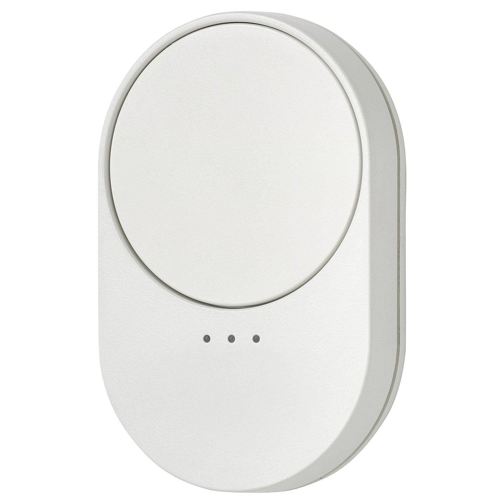

# IKEA BILRESA (E2490)

Technical notes on IKEA’s BILRESA scroll-wheel remote in Matter over Thread
and its undocumented Zigbee mode.

This document was drafted with Claude and OpenAI models. Sections marked
“verified” describe hardware measurements on firmware 1.8.5 and 1.8.7. Other
findings are attributed to the sources linked below.



| | |
|---|---|
| IKEA article number | 706.041.72 |
| Product name | BILRESA Remote control, white smart/scroll wheel |
| Type designation | E2490 |
| Price at time of writing | €8.99 |

Both Matter and Zigbee measurements were taken with the same M5Stack NanoC6
(ESP32-C6), running different firmware for each protocol. See
[Related](#related) for both firmware projects.

## 1. The device

| | |
|---|---|
| Model | E2490 (scroll wheel). E2489 is the dual-button sibling. |
| Chipset | Qorvo |
| Radio | IEEE 802.15.4 at 2.4 GHz (Thread/Matter or Zigbee) |
| Power | 2× AAA (battery % is calibrated for 1.5 V alkalines) |
| Controls | Scroll wheel (turn + click), a button below the LEDs, a system button inside the battery compartment |
| Indicators | 3 LEDs |
| Firmware seen | 1.8.5 (20250226) shipped, 1.8.7 after OTA |
| Zigbee model id | `09BA` (E2489 dual-button sibling: `09B9`) |
| Matter vendor | IKEA of Sweden, vendor id 4476 (0x117C) |
| Matter product | "BILRESA scroll wheel", product id 32768 (0x8000) |

Firmware updates are available only in Matter mode.

### Product groups

The button below the LEDs cycles through product groups 1, 2 and 3. The number
of lit LEDs shows the selected group. Wheel turns and clicks apply to that group.

How these groups appear depends on the protocol.

| Mode | Are the three groups distinguishable? |
|---|---|
| Matter/Thread | Yes, through separate endpoints (see §3) |
| Zigbee (to a coordinator) | No, actions do not identify the selected group |
| Touchlink (direct binding) | Yes, but only as fixed group IDs (see §4) |

## 2. Modes and LED indications (verified)

| LEDs | Meaning |
|---|---|
| All three pulsing | Matter/Thread commissioning. Default after factory reset, window 15 min |
| Red blinking while holding the system button | Factory reset in progress. Release when blinking stops |
| One LED blinking rapidly | Direct IKEA-product pairing (Touchlink). The lit LED shows the selected group |
| All LEDs dark | Zigbee network-join mode. No LED confirmation |
| Two quick blinks of all three | Success acknowledgement (also produced by Matter Identify, see §3.6) |

System-button sequences:

| Action | Result |
|---|---|
| Press once | Matter/system pairing (15 min window) |
| 4 rapid presses | Direct IKEA-product pairing / Touchlink |
| 8 rapid presses while in Touchlink | Undocumented Zigbee join mode |
| Hold ~10 s | Factory reset, followed by Matter pairing |

A pause between presses aborts a multi-press sequence.

## 3. Matter over Thread

The following measurements were read directly from the device with a Matter
controller.

### 3.1 Commissioning

To commission the remote you need its setup passcode and discriminator.
Both come from the Matter setup code, a QR plus an 11-digit manual pairing code,
printed on the battery cover, inside the battery
compartment, and on the yellow cover of the paperwork in the box. All three
carry the same device-specific code.

IKEA states that each product has its own QR code, and Matter requires a
randomly generated passcode per device. Keep the code private because anyone
with it can commission the remote while it is in pairing mode.

The passcode cannot be read back from a commissioned remote. Keep a copy of
the setup code so you can commission it again after a reset.

The QR encodes a string beginning `MT:`. Decode it to the fields a controller
wants with `chip-tool` from the Matter SDK:

```sh
chip-tool payload parse-setup-payload MT:XXXXXXXXXXXXXXXXXXX
chip-tool payload parse-manual-code 1234-567-8901
```

Use the decoded setup passcode and discriminator with your commissioner.

Press the system button inside the battery compartment once to open a
15-minute Matter pairing window. All three LEDs pulse. Four presses instead
start direct IKEA-product pairing.

Commissioning a retail BILRESA also requires IKEA's production attestation
root in your controller's trust store. Controllers configured only with the
Matter test PAAs will reject the device's certificate chain.

### 3.2 Endpoint map (verified)

The remote exposes nine endpoints, one per control, grouped in threes:

| Group | Turn one way | Turn the other | Wheel click |
|---|---|---|---|
| 1 | endpoint 1 | endpoint 2 | endpoint 3 |
| 2 | endpoint 4 | endpoint 5 | endpoint 6 |
| 3 | endpoint 7 | endpoint 8 | endpoint 9 |

Each endpoint exposes the Identify (0x0003), Descriptor (0x001D) and
Switch (0x003B) server clusters.

Home Assistant labels these endpoints "Button 1" through "Button 9" in the
same order. Controllers address them using the endpoint IDs in the table.

### 3.3 The root endpoint

```
Descriptor, AccessControl, BasicInformation, OtaSoftwareUpdateRequestor,
PowerSource, GeneralCommissioning, NetworkCommissioning, GeneralDiagnostics,
ThreadNetworkDiagnostics, AdministratorCommissioning, OperationalCredentials,
GroupKeyManagement, IcdManagement
```
The root endpoint has the device types Root Node, Power Source and OTA
Requestor. It has no Identify cluster, so LED indications must be requested
through a button endpoint.

### 3.4 Switch events (verified)

All six momentary Switch cluster events were observed:

| Event | id | Emitted by |
|---|---|---|
| InitialPress | 1 | every endpoint |
| LongPress | 2 | wheel-click endpoints 3, 6, 9 |
| ShortRelease | 3 | every endpoint |
| LongRelease | 4 | wheel-click endpoints 3, 6, 9 |
| MultiPressOngoing | 5 | every endpoint |
| MultiPressComplete | 6 | every endpoint |

The `FeatureMap` is not the same on every endpoint:

| Endpoints | FeatureMap | Features | MultiPressMax |
|---|---|---|---|
| 1, 2, 4, 5, 7, 8 (turn) | 22 (`0x16`) | MomentarySwitch, MomentarySwitchRelease, MomentarySwitchMultiPress | 18 |
| 3, 6, 9 (click) | 30 (`0x1E`) | those three plus MomentarySwitchLongPress (`0x08`) | 3 |

The wheel click advertises long-press support and the two turn directions do
not, which follows from the hardware: a detent step cannot be held. Reading the
`FeatureMap` on a single endpoint is therefore misleading, and 22 is the value
of a turn endpoint.

Holding a wheel click was measured on endpoints 3, 6 and 9. The remote emits
`LongPress` exactly 700 ms after `InitialPress`, in nine holds out of nine, then
`LongRelease` when the button is released:

| InitialPress to LongPress | InitialPress to LongRelease |
|---|---|
| 700 ms | 940 ms |
| 700 ms | 1080 ms |
| 700 ms | 1600 ms |
| 700 ms | 1920 ms |
| 700 ms | 1980 ms |
| 700 ms | 2200 ms |
| 700 ms | 2600 ms |
| 700 ms | 2620 ms |
| 700 ms | 6360 ms |

The 700 ms threshold is a hard edge, not a tolerance. Presses released at 480,
560, 580, 620 and 700 ms were all reported as ordinary taps, with
`ShortRelease` and no `LongPress`. A press has to outlast 700 ms to become a
hold, and there is no intermediate reporting.

These are the device’s own event timestamps, not arrival times at the
controller, which a sleepy device’s poll cadence stretches by seconds. A held
click emits no `ShortRelease` and no `MultiPressComplete`, so a hold is
distinguishable from a tap by the second event already.

The bit definitions and event requirements are in the
[Matter SDK’s Switch cluster definition](https://github.com/project-chip/connectedhomeip/blob/master/src/app/zap-templates/zcl/data-model/chip/switch-cluster.xml).

In Zigbee mode, the E2489’s buttons emit `Move`/`Stop` commands that integrations
expose as hold actions. The E2490’s wheel does not emit these commands.

Observed patterns:

```
single press   -> 1, 3, 6            (MultiPressComplete reports a count of 1)
repeated press -> 1, 3, 1, 5, 3, 6   (MultiPressOngoing carries a running count)
held click     -> 1, 2, 4            (no ShortRelease, no MultiPressComplete)
```

`MultiPressComplete` follows a single press too, with
`TotalNumberOfPressesCounted` of 1. Its multi-press timer runs from the press,
not from the release. Across sixteen measured single taps it arrived 500 to
520 ms after `InitialPress` whenever the button came up before then, and 15 ms
after the release when the press outlasted that:

| press to release | press to MultiPressComplete |
|---|---|
| 22 to 480 ms | 500 to 520 ms |
| 560 to 700 ms | release + 15 ms |

A controller that acts on `InitialPress` sees the press immediately; one that
waits for `MultiPressComplete` in order to count presses pays half a second on
every press.

`MultiPressMax` is 18 on the turn endpoints, limiting each event to a count of
18 detents even during a fast spin, and 3 on the click endpoints.

A wheel turn is reported as repeated button events, and
`MultiPressComplete.TotalNumberOfPressesCounted` equals the number of
detents turned. A 10-click turn arrives as a multi-press of 10. Use the count for
rotation distance and the endpoint for direction.

### 3.5 Sleep and event delivery (verified)

```
IdleModeDuration:          900 s
ActiveModeDuration:        1000 ms
UserActiveModeTriggerHint: 0x100 (ResetButton)
```

The remote is an intermittently connected device (ICD). Its sleep schedule
affects event delivery and command latency.

Set `IsUrgent` on the event path when subscribing. Otherwise, the device can
hold events until the next scheduled report. In testing, it negotiated a
900 s maximum reporting interval regardless of the requested interval,
matching its idle-mode duration. Without urgency, presses were recorded and could be retrieved with
`read-event`, but no event reports arrived during testing. With urgency set,
events arrived in milliseconds.

Home Assistant’s controller sets urgency internally. Custom controllers need
to set it explicitly.

Send commands just after a press for a quick response. The remote polls its parent
every ~7.5 s while idle and at ~100 ms during its 1 s active window. A command
sent while idle waits up to 7.5 s, while one sent in response to a press arrives
almost immediately. The parent’s logs can be used to observe this polling cadence.

### 3.6 LED feedback

Every one of the nine endpoints reports:

```
AcceptedCommandList: [0]   (Identify only, no TriggerEffect)
IdentifyType:        0     (None, "no presentation")
```

Despite reporting `IdentifyType: 0`, the remote blinks all three LEDs twice
when sent Identify (command 0). This was verified visually. The response is
the same on every endpoint. It confirms receipt of a command but does not
identify the selected group.

To acknowledge a button event, send Identify while the remote is still in its
active window. The LEDs respond within a fraction of a second.

### 3.7 Other controls and battery reporting

- The group-select button has no endpoint and emits no events. The endpoint
  reporting a wheel action identifies the selected group.
- Identify blinks all three LEDs together. Individual LEDs and colours cannot
  be controlled.
- Battery level is readable through `PowerSource` on the root endpoint, but
  has no event stream. `BatPercentRemaining` uses half-percent units (0–200),
  so a reading of 84 means 42%.

### 3.8 Multiple fabrics

```
SupportedFabrics:    5
CommissionedFabrics: 1
```

The remote can be commissioned into up to five Matter fabrics simultaneously, so
it can drive Home Assistant and your own controller at the same time, each with
its own subscriptions. Use `AdministratorCommissioning` to open a commissioning
window for the next fabric rather than factory resetting.

## 4. Zigbee mode

The E2490 also contains a legacy Zigbee stack, undocumented by IKEA, for
backwards compatibility with older TRÅDFRI gear. Zigbee2MQTT describes it as
limited and warns that it could be removed in a future firmware update.

The mode was discovered and published by u/Remarkable-Loquat-38 in
[BILRESA on Zigbee](https://www.reddit.com/r/tradfri/comments/1plqavn/bilresa_on_zigbee/)
(r/tradfri, 13 December 2025).

To enter Zigbee mode, factory reset the remote, press the system button four
times rapidly to enter Touchlink, then press it eight times rapidly. The LEDs
go dark on entering join mode. Pairing may require several attempts because
interviews can fail. The device may take several minutes to appear at the
coordinator without LED confirmation. Community reports describe the same
4-then-8 sequence on the E2489 and KAJPLATS. Reports for MYGGSPRAY and MYGGBETT
describe Touchlink pairing but no successful network joins.

### A Matter commissioned remote will not do Touchlink

Observed on hardware. While the remote was commissioned over Matter and Thread,
the four press Touchlink sequence produced nothing at a Zigbee coordinator. A
factory reset was required before Touchlink behaved as documented. This is
consistent with the remote holding exactly one transport at a time, and it means
Zigbee experiments cost the existing Matter commissioning.

The reset is not free. The remote leaves its Matter fabric, so it must be
commissioned again from its setup code afterwards, and any controller holding a
subscription to it stops receiving events.

### Touchlink to a non IKEA target fails at the network key

Tested against an ESP32-C6 running the esp-zigbee SDK as a factory new router,
which is the role a remote can adopt. The handshake starts, the target joins and
the remote's group ids can be added to its endpoint, and then every frame from
the remote is rejected with NWK status 0x12, bad key sequence number. The remote
keeps blinking because its initiator never sees the exchange complete.

Key handling is the most likely cause and is not proven. The transferred network
key is encrypted with either the certification key, index 15, which is public,
or the master key, index 4, which is shared by certified Touchlink devices. An
open stack advertises both and prefers the certification key. Whether installing
a production master key completes the exchange with this remote has not been
tested, so treat this as reaching network setup and failing during secured
communication, rather than as impossible.

### Action mapping (per Zigbee2MQTT and verified capture)

All three product groups share one endpoint. The remote uses On/Off and Level
client clusters to send commands to a group. These clusters do not host
readable state on the remote.

| Control | Cluster (client) | Behaviour |
|---|---|---|
| Wheel turn | Level `0x0008` | Repeated `MoveToLevel` with absolute levels, one every ~101 ms |
| Wheel click | On/Off `0x0006` | Alternating `On` / `Off` commands, state held per group on the remote |
| Group button | None | Nothing reaches the coordinator |

See [zigbee-details.md](zigbee-details.md) for the endpoint and cluster map,
command glitches, battery reporting, minimum integration versions, and reports
of missing events with some coordinators.

### Integration support

Support for the E2490 and E2489 was added in the following versions:

| Stack | Supported since |
|---|---|
| Zigbee2MQTT | zigbee-herdsman-converters 25.98.0 / Z2M 2.7.2, via [converters#11154](https://github.com/Koenkk/zigbee-herdsman-converters/pull/11154) |
| ZHA | quirk v2 [zha-device-handlers#4612](https://github.com/zigpy/zha-device-handlers/pull/4612), merged 24 March 2026 |

Missing button events after successful pairing, with only battery and link
quality updates, have been reported with EFR32MG24 / EFR32MG21 coordinators
(ZBT-2). The root cause is unconfirmed. See
[bellows#708](https://github.com/zigpy/bellows/issues/708).

### Fixed group IDs

Touchlink channels 1/2/3 map to hardcoded group IDs 21658, 21659, 21660
(scenes use 65289). These cannot be changed, and group 21658 collides with the
E2489. BILRESA remotes in radio range use the same groups, so binding cannot
assign separate targets to each remote. Use automation to assign separate
targets.

## 5. Choosing a mode

| | Groups distinguishable | Dimming | Hub needed | Firmware updates |
|---|---|---|---|---|
| Matter/Thread | Yes, per endpoint | Detent count via multi-press | Thread network + controller | Yes |
| Zigbee coordinator | No | Yes, absolute levels (reported as more responsive than Matter) | Coordinator | No |
| Touchlink direct | Yes, as fixed groups | Yes, local | None | No |

Use Matter for three distinguishable groups and firmware updates. See §3.4
for converting wheel events to a detent count.

## Related

Community work on this device:

- [BILRESA on Zigbee](https://www.reddit.com/r/tradfri/comments/1plqavn/bilresa_on_zigbee/)
  (r/tradfri) documents the Zigbee mode discovery and first-hand reports.
- [IKEA E2490 BILRESA scroll wheel](https://community.home-assistant.io/t/ikea-e2490-bilresa-scroll-wheel/976506)
  (Home Assistant forum) provides a Z2M/ZHA blueprint for brightness, volume,
  colour temperature and hue, with mode cycling on double-press. The thread
  also includes user reports.
- [IKEA Bilresa 2 Button Remote pairs with ZHA](https://community.home-assistant.io/t/ikea-bilresa-2-button-remote-pairs-with-zha/968513)
  (Home Assistant forum) covers the E2489 sibling.

Measurement tools:

- [esp32c6-matter-thread-controller](https://github.com/tdamsma/esp32c6-matter-thread-controller) uses an ESP32-C6 as a Thread network and Matter controller without a border router. It was used for the Matter measurements.
- [esp32c6-zigbee-probe](https://github.com/tdamsma/esp32c6-zigbee-probe) uses an ESP32-C6 as a Zigbee coordinator. It was used to capture the remote’s commands.

## Sources

- IKEA BILRESA advice and instructions (PDF), sections "Pairing mode" and "Factory reset"
- Zigbee2MQTT device pages: [E2490](https://www.zigbee2mqtt.io/devices/E2490.html), [E2489](https://www.zigbee2mqtt.io/devices/E2489.html)
- FCC ID `FHO-E2490`. CSA certifications list the device for both Matter and Zigbee.
- Product photo © Inter IKEA Systems B.V., from the [BILRESA product page](https://www.ikea.com/nl/en/p/bilresa-remote-control-white-smart-scroll-wheel-70604172/)
- Zigbee mode discovery and first-hand community reports: [r/tradfri, "BILRESA on Zigbee"](https://www.reddit.com/r/tradfri/comments/1plqavn/bilresa_on_zigbee/), 13 December 2025
- Zigbee interview data, model ids and converter work: Zigbee2MQTT issues [#30321](https://github.com/Koenkk/zigbee2mqtt/issues/30321) and [#30325](https://github.com/Koenkk/zigbee2mqtt/issues/30325), resolved by [zigbee-herdsman-converters#11154](https://github.com/Koenkk/zigbee-herdsman-converters/pull/11154)
- ZHA quirk v2: [zigpy/zha-device-handlers#4612](https://github.com/zigpy/zha-device-handlers/pull/4612)
- Missing events on EFR32MG24/MG21 coordinators: [zigpy/bellows#708](https://github.com/zigpy/bellows/issues/708) (open, root cause unconfirmed)
- Matter measurements were taken with an ESP32-C6 acting as its own Thread leader and Matter controller. See [esp32c6-matter-thread-controller](https://github.com/tdamsma/esp32c6-matter-thread-controller)
